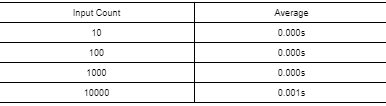
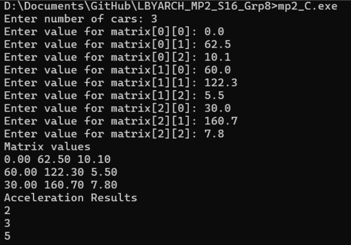
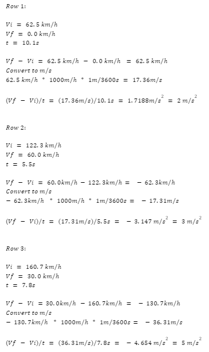

# LBYARCH_MP2_S16_Grp8

# Performance Test:

Considering the table above, the performance of the program scales well as input size increases. The execution
times are close to zero, a constant, despite the time complexity of program being O(n). Moreover, even at 10,000
inputs, the execution time is still minimal at 0.001s. Thus, it can be concluded that the program is excellent 
performance-wise.

# Correctness Check:

Above, we can see that the correctness of the program is accurate with the manual calculations. The answers closely
align with the manual calculations, therefore being correctly implemented.  

